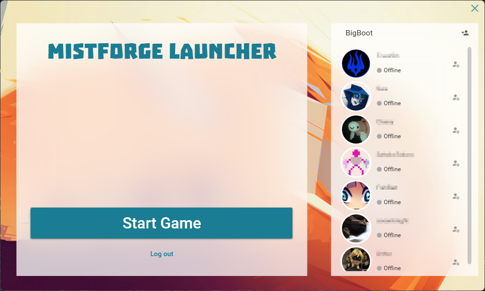
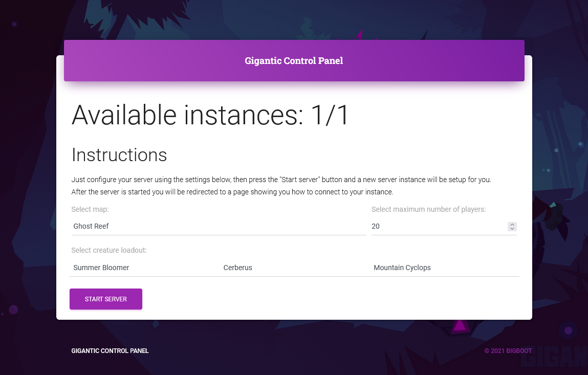

 


# GiganticEmu 
A backend emulator for the game Gigantic by Motiga.


## GiganticEmu.Launcher (Mistforge Launcher)
Avalonia based launcher application for connecting to the emulated backend.



## GiganticEmu.Agent
Provides a WebInterface and a REST api for hosting private Servers.


## GiganticEmu.Web
Provides a Rest API for user account creation/login.
As well as some methods required for authenticating the game clients.

## GiganticEmu.Mice
Implements the TCP based MICE protocol used by the client to talk to the backend.

## Instructions
* Download the Misfroge Launcher from the [latest release](https://github.com/BigBoot/GiganticEmu/releases/latest) into your Gigantic folder.
* Start the MistforgeLauncher.exe 

## Building
Requirements:
* MSVC 2019 (e.g. Visual Studio 2019 with C++ Build Tools)
* CMake
* .NET SDK 5.0
* Powershell 7.x

```
./dist.ps1
```
The resulting files will be in dist/

## Troubleshooting

#### The game crashes with an error report:
Install the latest vc_redist: https://aka.ms/vs/16/release/vc_redist.x64.exe
